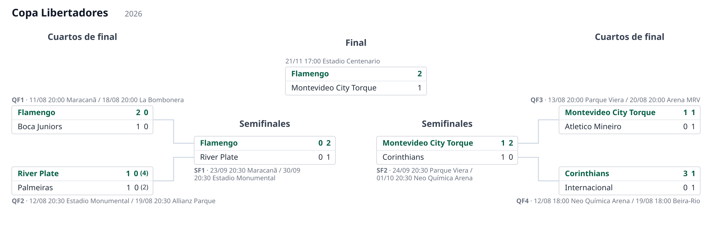
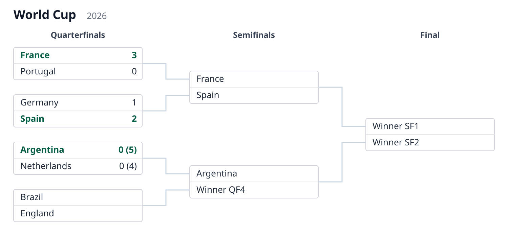

# playoff-diagrams

[](https://github.com/anibalpacheco/playoff-diagrams/actions/workflows/ci.yml)
[](LICENSE)

Render a football (soccer) **playoff bracket** as an **SVG**, on the fly, from a
**JSON source document**.

The bracket is described by a small JSON "language" that is meant to live in a
database field (e.g. Postgres `JSONB`) on a championship/cup entity. Updating results
means editing that JSON — no code changes, and no per-cup HTML templates to maintain.

## Examples

Both diagrams below are rendered from the JSON files in [`examples/`](examples/), with
no per-cup templates involved.

Two-legged ties ([`libertadores-2026.json`](examples/libertadores-2026.json)) — each
leg's goals are shown, shootouts appear in parentheses, and the winner of each tie is
emphasized. The first quarterfinal is **host-resolved**: its legs carry only a `ref`, so
its teams and scores come from `get_match` (see
[`examples/libertadores_host.py`](examples/libertadores_host.py)) rather than from the
document. Played ties take their team names from the legs; the final is a single match —
one leg, so just one goal figure per side — with its `winnerof` links carrying the bracket:



Single matches ([`knockout-8.json`](examples/knockout-8.json)) — one goal figure per
side, with shootouts in parentheses. Sides that have not been resolved yet fall back to
placeholders such as "Winner SF2":



## The format

The bracket is plain JSON: it is what a database field speaks natively, and the
language is designed so a bracket node can evolve from a **placeholder** (e.g. "winner
of QF1") into a **reference to a real match entity** — each leg can carry a `ref` to
the real game, resolved dynamically by the host — without changing the language. A
bracket is essentially a tree, so its layout is **deterministic**: coordinates are
computed directly and the SVG is emitted as a string, with no layout engine and no
heavy dependencies.

See [`spec/format.md`](spec/format.md) for the full specification and
[`spec/schema.json`](spec/schema.json) for the JSON Schema. Worked examples live in
[`examples/`](examples/).

Minimal example:

```json
{
  "tournament": "Copa Libertadores",
  "season": "2026",
  "rounds": [
    {
      "name": "Final",
      "matches": [
        {
          "id": "final",
          "legs": [
            { "team1": "Flamengo", "goals1": 1, "team2": "Nacional", "goals2": 2 }
          ],
          "winner": 2
        }
      ]
    }
  ]
}
```

## Quickstart

Requires Python ≥ 3.10. No runtime dependencies.

```bash
git clone https://github.com/anibalpacheco/playoff-diagrams.git
cd playoff-diagrams
python -m venv .venv && source .venv/bin/activate
pip install -e .
```

Render a self-contained example to an SVG file:

```bash
# via the installed command
playoff-diagrams examples/knockout-8.json -o knockout.svg

# or via the module, writing to stdout
python -m playoff_diagrams examples/knockout-8.json > knockout.svg
```

Open the resulting `.svg` in a browser to view the bracket. To render your own cup,
point the command at any JSON file that follows [`spec/format.md`](spec/format.md).

Use it from Python:

```python
from playoff_diagrams import load_bracket, render_svg

svg = render_svg(load_bracket("examples/knockout-8.json"))
```

## Integrating it into your project

It is a standard pip-installable package with no runtime dependencies — install it
straight from GitHub:

```bash
pip install git+https://github.com/anibalpacheco/playoff-diagrams.git
```

[docs/usage.md](docs/usage.md) is the usage manual: rendering from the CLI and from
Python (e.g. a Django view), feeding live data from your own database through
`PlayoffDiagram`, and updating the stored bracket with `apply_results` — including a
before/after walkthrough of one call.

### Running the tests

```bash
pip install -e ".[dev]"
pytest
```

The suite includes golden (snapshot) SVG tests under `tests/golden/`. When output
changes on purpose, regenerate them with `PD_REGEN=1 pytest tests/test_render.py` and
review the diff.

## Scope

**Single-elimination**, with single matches and two-legged ties decided by penalty
shootouts.

## Status

Working: the language spec, JSON Schema, Python renderer, CLI and tests are in place,
and the package is installable from GitHub.
