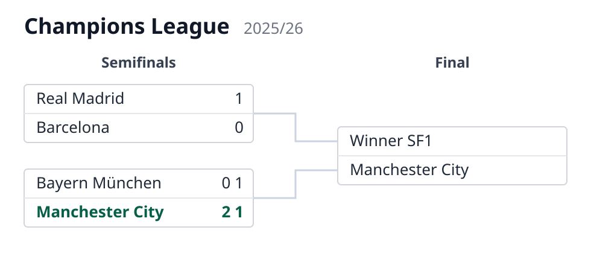
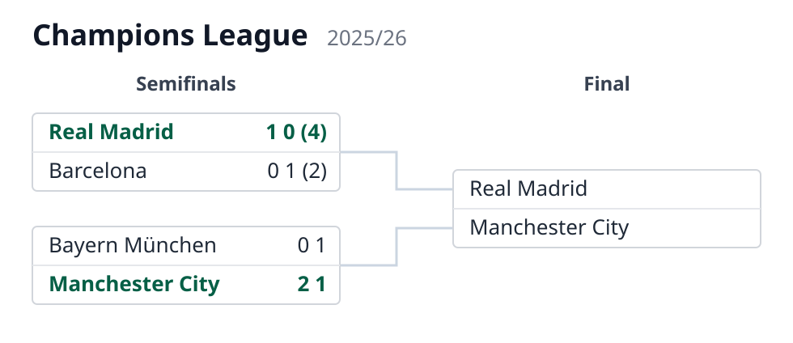

# Usage

How to put the library to work, from a one-off render to a host application that keeps
its brackets up to date. For the JSON language itself see
[the spec](../spec/format.md); for a first taste, the README's quickstart.

- [Rendering from the command line](#rendering-from-the-command-line)
- [Rendering from Python](#rendering-from-python)
- [Live data and dynamic titles: `PlayoffDiagram`](#live-data-and-dynamic-titles-playoffdiagram)
- [Applying results: `apply_results`](#applying-results-apply_results)

## Rendering from the command line

The package installs a `playoff-diagrams` command (also runnable as
`python -m playoff_diagrams`):

```bash
# via the installed command
playoff-diagrams examples/knockout-8.json -o knockout.svg

# or via the module, writing to stdout
python -m playoff_diagrams examples/knockout-8.json > knockout.svg
```

Open the resulting `.svg` in a browser to view the bracket. To render your own cup,
point the command at any JSON file that follows [the spec](../spec/format.md).

The CLI renders self-contained documents. A document with host-resolved legs (a `ref`
with no host attached) shows those legs as not played; the Copa Libertadores example is
like that, so it is rendered through its example host instead:

```bash
PYTHONPATH=src python examples/libertadores_host.py > libertadores.svg
```

## Rendering from Python

```python
from playoff_diagrams import load_bracket, render_svg

svg = render_svg(load_bracket("examples/knockout-8.json"))
```

`parse_bracket` does the same from an already-loaded dict. In a web app the SVG is the
response body — e.g. a Django view:

```python
from django.http import HttpResponse
from playoff_diagrams import parse_bracket, render_svg

def bracket_svg(request, championship):
    svg = render_svg(parse_bracket(championship.bracket_json))
    return HttpResponse(svg, content_type="image/svg+xml")
```

### Installing into your project

A standard pip-installable package with no runtime dependencies — install it straight
from GitHub:

```bash
pip install git+https://github.com/anibalpacheco/playoff-diagrams.git
```

Pin a specific release or commit with `...playoff-diagrams.git@<tag-or-sha>`, or add
that same line to your `requirements.txt`.

## Live data and dynamic titles: `PlayoffDiagram`

The renderer never computes results: the winner of a match is its explicit `winner`
field, and an advancing team is whatever `team1`/`team2` the document records on a match.
To feed live data from your own database instead of (or on top of) the JSON, subclass
`PlayoffDiagram`. Whenever a leg carries a `ref`, `get_match(ref)` is called with it; you
return that one game as a flat dict, local first (`team1`/`goals1`, `team2`/`goals2`). The
tournament name and season can also be supplied dynamically:

```python
from playoff_diagrams import PlayoffDiagram

class ChampionshipDiagram(PlayoffDiagram):
    def __init__(self, championship):
        super().__init__(championship.bracket_json)
        self._championship = championship

    def get_match(self, ref):
        g = Match.objects.get(pk=ref)            # your own model
        return {
            "team1": g.home.name, "goals1": g.home_goals, "pen1": g.home_pens,
            "team2": g.away.name, "goals2": g.away_goals, "pen2": g.away_pens,
        }

    def get_tournament(self):
        return self._championship.name

    def get_season(self):
        return str(self._championship.year)

def bracket_svg(request, championship):
    svg = ChampionshipDiagram(championship).render()
    return HttpResponse(svg, content_type="image/svg+xml")
```

`get_match` returns only what it has — any of `team1`/`goals1`/`pen1` and their `2`
counterparts; a returned `None` leaves that leg as the document defines it. Where a side
has no team yet, the resolved name is filled in from the live game while the bracket
connector (`winnerof1`/`winnerof2`) is kept.

The document's display preferences are available to the hooks as `self.render_config`,
so `get_match` can, for instance, read `self.render_config.max_label_chars` and return
already-shortened names. Long-named cups can raise that limit (it defaults to `22`) in
the document's `render` object.

## Applying results: `apply_results`

When a game finishes (or while it is being played), write its result onto the document
with `apply_results` and persist what it returns — the structure of the bracket never
changes, only the JSON field does:

```python
diagram = PlayoffDiagram(championship.bracket_json)
championship.bracket_json = diagram.apply_results(
    {"id": "sf1", "leg": 2, "goals1": 0, "goals2": 3}
)
championship.save()
```

Each result addresses one leg, either by `ref` (the leg pointing at that real game) or
by match `id` plus an optional 1-based `leg` number (default 1; missing legs are
created). Scores are tie-oriented — `goals1` belongs to the match's top side — and the
present keys simply overwrite the leg, so a live game can be re-applied as it goes. A
list applies several results at once.

By default every touched match is then *settled*: its `winner` is recomputed from the
aggregate (penalties break a tied one), removed when undecided, and the advancing team
is pushed into the match that consumes it via `winnerof`. Pass `settle=False` to skip
that, or put `"settle": false` on a match to keep it out permanently — the renderer
itself still never computes anything.

### Before and after, end to end

One call, walked through. The two documents below are real assets, kept in sync by the
library itself: [`apply-before.json`](apply-before.json) is hand-written, and
[`apply-after.json`](apply-after.json) is exactly what `apply_results` returns for it
(see "Regenerating" below).

#### Before

A semifinal stage mid-series. `sf1` has its first leg played (1–0) and the second one
scheduled (`{}`); `sf2` is already settled, so the final knows its bottom side while the
top one still shows the "Winner SF1" placeholder:

```json
{
  "tournament": "Champions League",
  "season": "2025/26",
  "rounds": [
    {
      "name": "Semifinals",
      "matches": [
        {
          "id": "sf1",
          "team1": "Real Madrid",
          "team2": "Barcelona",
          "legs": [
            { "goals1": 1, "goals2": 0 },
            {}
          ]
        },
        {
          "id": "sf2",
          "team1": "Bayern München",
          "team2": "Manchester City",
          "winner": 2,
          "legs": [
            { "goals1": 0, "goals2": 2 },
            { "goals1": 1, "goals2": 1 }
          ]
        }
      ]
    },
    {
      "name": "Final",
      "matches": [
        {
          "id": "f",
          "winnerof1": "sf1",
          "winnerof2": "sf2",
          "team2": "Manchester City"
        }
      ]
    }
  ]
}
```



#### The call

The second leg finishes 1–0 for Barcelona, taking the tie to penalties, which Real Madrid
wins 4–2. That is one result dict — scores are tie-oriented, so `goals1`/`pen1` belong
to the match's top side (Real Madrid) no matter where the game was played:

```python
from playoff_diagrams import PlayoffDiagram

diagram = PlayoffDiagram(document)
updated = diagram.apply_results(
    {"id": "sf1", "leg": 2, "goals1": 0, "goals2": 1, "pen1": 4, "pen2": 2}
)
```

#### After

Three things changed in the document, all from that single call:

1. the second leg of `sf1` now carries the result and the shootout;
2. `sf1` was *settled*: the aggregate is 1–1, the shootout breaks it, so
   `"winner": 1` was written;
3. the winner advanced: the final's side 1 got `"team1": "Real Madrid"`.

```json
{
  "tournament": "Champions League",
  "season": "2025/26",
  "rounds": [
    {
      "name": "Semifinals",
      "matches": [
        {
          "id": "sf1",
          "team1": "Real Madrid",
          "team2": "Barcelona",
          "legs": [
            { "goals1": 1, "goals2": 0 },
            { "goals1": 0, "goals2": 1, "pen1": 4, "pen2": 2 }
          ],
          "winner": 1
        },
        {
          "id": "sf2",
          "team1": "Bayern München",
          "team2": "Manchester City",
          "winner": 2,
          "legs": [
            { "goals1": 0, "goals2": 2 },
            { "goals1": 1, "goals2": 1 }
          ]
        }
      ]
    },
    {
      "name": "Final",
      "matches": [
        {
          "id": "f",
          "winnerof1": "sf1",
          "winnerof2": "sf2",
          "team2": "Manchester City",
          "team1": "Real Madrid"
        }
      ]
    }
  ]
}
```



The host persists `updated` (it is the same mutated document) back into its database
field, and every render from then on shows the new state.

#### Regenerating

After a change to the library or to `apply-before.json`:

```bash
PYTHONPATH=src python - <<'EOF'
import json
from playoff_diagrams import PlayoffDiagram

with open("docs/apply-before.json", encoding="utf-8") as fh:
    doc = json.load(fh)
out = PlayoffDiagram(doc).apply_results(
    {"id": "sf1", "leg": 2, "goals1": 0, "goals2": 1, "pen1": 4, "pen2": 2}
)
with open("docs/apply-after.json", "w", encoding="utf-8") as fh:
    json.dump(out, fh, indent=2, ensure_ascii=False)
    fh.write("\n")
EOF
PYTHONPATH=src python -m playoff_diagrams docs/apply-before.json -o /tmp/apply-before.svg
PYTHONPATH=src python -m playoff_diagrams docs/apply-after.json -o /tmp/apply-after.svg
rsvg-convert -z 2 /tmp/apply-before.svg -o docs/apply-before.png
rsvg-convert -z 2 /tmp/apply-after.svg -o docs/apply-after.png
```

(Then update the inline JSON blocks above if the documents changed.)
